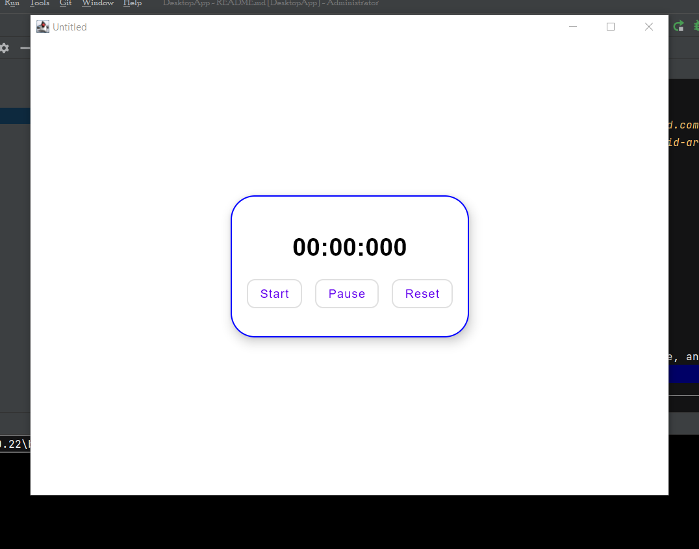
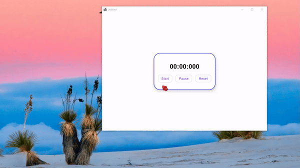

# Jetpack Compose <b>✨Desktop App✨</b> ( ⏲ Stopwatch ⏲ ). 🔥💥⌚

### Jetpack Compose Stopwatch 😍⌛⏲

## Preview - ⏲ Stopwatch ⏲

## About

Introducing a sleek stopwatch application for desktop, built using Kotlin, Jetpack Compose, and Coroutines. This app boasts a simple yet elegant UI design, making time tracking a breeze. With the power of Jetpack Compose, users can enjoy a modern interface that adapts seamlessly to different screen sizes. Thanks to Coroutines, the stopwatch functions smoothly without compromising performance. Whether you're timing tasks or measuring intervals, this stopwatch promises a user-friendly experience with its intuitive design and efficient functionality. Experience the convenience of time management with style and ease.
